# NotebookLM Briefing Pipeline

End-to-end automation for AI news/research briefings:

- curate AM/PM briefing source packs;
- capture raw article content for a knowledge base handoff;
- publish briefing packs to NotebookLM;
- request NotebookLM Audio Overviews;
- cache/transcode audio to MP3;
- publish a public Apple Podcasts-compatible RSS feed via Cloudflare R2 + Worker;
- run health checks, recovery syncs, and FIFO retention guardrails.

This repository is a public-safe export of the workflow. Runtime state, credentials, generated briefings, logs, local caches, and MP3/WAV files are intentionally excluded.

## Layout

- `notebooklm-briefing-pipeline/` — main AM/PM briefing + NotebookLM + podcast feed pipeline.
- `daily_research_paper_audio.py` — daily AI research-paper NotebookLM/audio workflow.
- `podcast-audio-worker/` — Cloudflare Worker that serves `feed.xml`, cover art, and byte-range audio from R2.

## Workflow diagram

```mermaid
flowchart LR
    %% Public-safe end-to-end view. Runtime credentials/state are intentionally omitted.

    subgraph sources["📰 Source intake"]
        written["Written AI briefings<br/>AM / PM text files"]
        manual["Manual article links<br/>Discord intake"]
        research["Daily research paper<br/>optional deep dive"]
    end

    subgraph curate["🧠 Curation pipeline"]
        ingest["Parse + normalize<br/>stories, URLs, scores"]
        dedupe["Deduplicate<br/>SQLite item IDs"]
        classify["Classify streams<br/>Priority · Agents · Research<br/>Policy · Products · Case Studies"]
        packs["Build source packs<br/>AM · PM · Research<br/>Markdown + JSON"]
    end

    subgraph notebooklm["🎙️ NotebookLM publishing"]
        notebook["Create fresh notebook"]
        upload["Upload source pack"]
        audio["Request Audio Overview<br/>with focus prompt"]
        runs["Record publish run<br/>state.db"]
    end

    subgraph podcast["📡 Podcast publication"]
        health["Feed health check"]
        ready{"Audio ready?"}
        cache["Download + cache audio"]
        transcode["Transcode WAV → MP3"]
        r2["Upload MP3 to Cloudflare R2"]
        rss["Generate RSS feed.xml"]
        worker["Cloudflare Worker serves<br/>feed + byte-range audio"]
    end

    subgraph listeners["🎧 Listening surfaces"]
        apple["Apple Podcasts"]
        clients["Podcast apps / browsers"]
    end

    written --> ingest
    manual --> ingest
    research --> packs
    ingest --> dedupe --> classify --> packs
    packs --> notebook --> upload --> audio --> runs
    runs --> health --> ready
    ready -- "not yet" --> retry["Mark pending<br/>self-healing retry"]
    retry --> health
    ready -- "yes" --> cache --> transcode --> r2 --> rss --> worker
    worker --> apple
    worker --> clients

    classDef source fill:#eef6ff,stroke:#4c8eda,color:#0b3558;
    classDef process fill:#f4f0ff,stroke:#8b5cf6,color:#2e1065;
    classDef publish fill:#ecfdf5,stroke:#10b981,color:#064e3b;
    classDef decision fill:#fff7ed,stroke:#f97316,color:#7c2d12;
    classDef output fill:#fef2f2,stroke:#ef4444,color:#7f1d1d;

    class written,manual,research source;
    class ingest,dedupe,classify,packs,notebook,upload,audio,runs process;
    class health,cache,transcode,r2,rss,worker publish;
    class ready decision;
    class apple,clients,retry output;
```



## Configure

1. Copy `notebooklm-briefing-pipeline/config.example.json` to `notebooklm-briefing-pipeline/config.json`.
2. Fill in local credentials, paths, SMTP settings, Discord IDs, Cloudflare bucket/domain, and NotebookLM profile details.
3. Copy `podcast-audio-worker/wrangler.example.jsonc` to `podcast-audio-worker/wrangler.jsonc` and set your Cloudflare zone/routes/R2 bucket.
4. Never commit real `config.json`, `.env`, `.dev.vars`, databases, logs, or generated audio.

## Key reliability guardrails

- NotebookLM generated-notebook FIFO cleanup keeps the latest generated notebooks below account limits.
- R2 audio FIFO cleanup keeps cached/published MP3s below the configured storage cap before rebuilding the feed.
- Empty-feed guard prevents uploading an RSS feed with zero ready MP3 episodes.
- Health checks verify the live feed, required AM/PM/RESEARCH entries, and public MP3 reachability.
- Recovery sync retries R2 publication when NotebookLM audio finishes rendering after the initial publish window.

## Current defaults

- NotebookLM generated notebook retention: keep latest `80` generated notebooks.
- R2 audio retention cap: `8.0 GB`, below Cloudflare R2's 10 GB-month free tier.
- Canonical feed shape: `https://podcast.example.com/feed.xml`.
- Audio object shape: `audio/<notebook_id>.mp3`.

## Minimal checks

```powershell
python -m py_compile notebooklm-briefing-pipeline\run_pipeline.py `
  notebooklm-briefing-pipeline\scripts\sync_podcast_feed_to_r2.py `
  notebooklm-briefing-pipeline\scripts\podcast_feed_health_check.py `
  daily_research_paper_audio.py

python notebooklm-briefing-pipeline\scripts\sync_podcast_feed_to_r2.py --recent 2 --dry-run --no-web-module
```

## Security note

This workflow touches email, Discord, Google/NotebookLM, Cloudflare, and public podcast infrastructure. Treat config files and runtime logs as sensitive. Use app passwords/tokens via local config or environment variables only.

