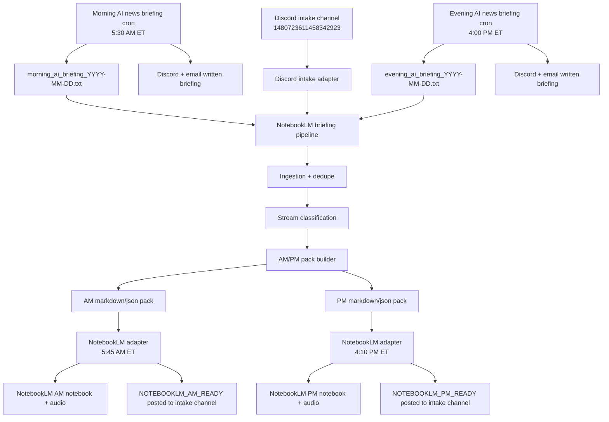

# NotebookLM Commute Briefing Automation Reference

_Last updated: 2026-03-10_

This document is the canonical reference for the current AI briefing + NotebookLM commute automation.

It explains:
- what the automation does
- which cron jobs are involved
- which channels are used
- how morning/evening briefings flow into NotebookLM
- where state and logs live
- how to operate, debug, and extend the system safely

---

## 1) Goal

The system creates two daily, personalized NotebookLM commute briefings for Ashish:

- **Morning commute briefing**
- **Evening commute briefing**

These audio briefings are built from:
- the regular AI text briefings sent on Discord + email
- manually shared links/articles in the dedicated NotebookLM intake channel
- classification and curation into learning streams
- NotebookLM notebook creation + source upload + audio overview generation

The intended user experience is:
1. morning/evening written briefings arrive as usual
2. manual links dropped into the intake channel are captured automatically
3. the pipeline curates the relevant material for AM/PM commute use
4. NotebookLM receives a fresh AM/PM notebook
5. Ashish listens via the NotebookLM iPhone app during commute

---

## 2) High-Level Architecture

### Mermaid Diagram

_Temporary placeholder diagram. Replace this section later with an Excalidraw version once the Excalidraw MCP workflow is fully in use._



There are **two layers**:

### Layer A — briefing generation
Existing OpenClaw cron jobs generate the written morning/evening briefings and send them to:
- Discord
- email recipients

Those jobs also save the exact rendered briefing text to workspace files.

### Layer B — NotebookLM commute pipeline
A custom local pipeline:
- ingests saved briefing files
- ingests manually shared Discord links
- dedupes content
- classifies items into streams
- builds AM/PM briefing packs
- publishes them into NotebookLM
- requests NotebookLM audio overview generation

---

## 3) Current Channels

### A) Main AI briefing channel
- **Channel ID:** `1476096501880066060`
- Purpose:
  - morning AI written briefing
  - evening AI written briefing

### B) NotebookLM intake / related automation channel
- **Channel ID:** `1480723611458342923`
- Purpose:
  - manual article/link intake
  - NotebookLM pipeline announcements
  - AM/PM NotebookLM-ready notifications
  - ongoing NotebookLM-related workflow discussion

### Current routing rule
- **Written briefings** stay in the AI briefing channel
- **NotebookLM automation reporting** goes to the NotebookLM intake channel

---

## 4) Current Cron Jobs Involved

## 4.1 Morning written briefing
- **Job name:** `Morning AI news briefing`
- **Job ID:** `d300fc68-a33d-4171-98a7-4228e48edb3a`
- **Schedule:** `5:30 AM ET` weekdays
- **Delivery:** Discord + email
- **Model:** `openai-codex/gpt-5.4`

### Responsibilities
- research the morning AI stories
- generate a detailed written briefing
- save the full text to workspace:
  - `C:\path\to\workspace\morning_ai_briefing_{{today}}.txt`
- send email to:
  - `recipient@example.com`
  - `recipient2@example.com`
- announce summary to the AI briefing Discord channel

### Important note
This saved file is a dependency for the NotebookLM AM pipeline.
If it is not written correctly, the AM audio pipeline will not have the intended morning source text.

---

## 4.2 Evening written briefing
- **Job name:** `Evening AI news briefing`
- **Job ID:** `3f20e625-135f-4f6f-8891-aeb81b84154a`
- **Schedule:** `4:00 PM ET` daily
- **Delivery:** Discord + email
- **Model:** `openai-codex/gpt-5.4`

### Responsibilities
- research the top AI stories of the day
- generate a detailed written briefing
- save the full text to workspace:
  - `C:\path\to\workspace\evening_ai_briefing_{{today}}.txt`
- send email to:
  - `recipient@example.com`
  - `recipient2@example.com`
- announce summary to the AI briefing Discord channel

### Important note
This saved file is a dependency for the NotebookLM PM pipeline.

---

## 4.3 NotebookLM AM commute publish
- **Job name:** `NotebookLM AM commute briefing publish`
- **Job ID:** `d2e0c063-5777-48a3-9983-9ae8cf439bb3`
- **Schedule:** `5:45 AM ET` weekdays
- **Delivery channel:** `1480723611458342923`
- **Model:** `openai-codex/gpt-5.4`

### Responsibilities
- run:
  - `python C:\path\to\workspace\notebooklm-briefing-pipeline\run_pipeline.py --date {{today}} --mode AM`
- return only one line:
  - `NOTEBOOKLM_AM_READY: <url>`
  - or `NOTEBOOKLM_AM_ERROR: <reason>`

### Intended timing
This gives ~15 minutes between the morning text briefing (5:30) and the AM NotebookLM publish job (5:45), so the audio should be ready before the 6:00 AM commute.

---

## 4.4 NotebookLM PM commute publish
- **Job name:** `NotebookLM PM commute briefing publish`
- **Job ID:** `fbb4d65f-f2be-4132-8de0-d703c9caf979`
- **Schedule:** `4:10 PM ET` daily
- **Delivery channel:** `1480723611458342923`
- **Model:** `openai-codex/gpt-5.4`

### Responsibilities
- run:
  - `python C:\path\to\workspace\notebooklm-briefing-pipeline\run_pipeline.py --date {{today}} --mode PM`
- return only one line:
  - `NOTEBOOKLM_PM_READY: <url>`
  - or `NOTEBOOKLM_PM_ERROR: <reason>`

### Intended timing
This gives ~10 minutes between the evening written briefing (4:00) and the PM NotebookLM publish job (4:10), so the audio should be ready before the 4:15 PM commute.

---

## 5) Pipeline Folder Layout

Root:
- `C:\path\to\workspace\notebooklm-briefing-pipeline`

Key files:
- `AUTOMATION_REFERENCE.md` ← this document
- `README.md`
- `ARCHITECTURE.md`
- `config.json`
- `run_pipeline.py`
- `show_status.py`
- `state.db`

Subfolder:
- `pipeline\`
  - `db.py`
  - `models.py`
  - `ingestion.py`
  - `dedupe.py`
  - `classifier.py`
  - `pack_builder.py`
  - `discord_adapter.py`
  - `notebooklm_adapter.py`

Outputs:
- `outputs\YYYY-MM-DD_AM_briefing.md`
- `outputs\YYYY-MM-DD_AM_briefing.json`
- `outputs\YYYY-MM-DD_PM_briefing.md`
- `outputs\YYYY-MM-DD_PM_briefing.json`

Workspace briefing source files:
- `C:\path\to\workspace\morning_ai_briefing_YYYY-MM-DD.txt`
- `C:\path\to\workspace\evening_ai_briefing_YYYY-MM-DD.txt`

---

## 6) Current Data Flow

## 6.1 AM flow
1. Morning cron generates the written AI briefing at **5:30 AM ET**
2. It saves the rendered text to `morning_ai_briefing_YYYY-MM-DD.txt`
3. AM NotebookLM cron runs at **5:45 AM ET**
4. Pipeline ingests:
   - saved morning briefing file(s)
   - manual Discord intake items in the AM window
5. Pipeline builds `YYYY-MM-DD_AM_briefing.md`
6. NotebookLM adapter creates a fresh notebook
7. NotebookLM adapter uploads the markdown source
8. NotebookLM adapter requests audio overview creation
9. The cron job announces:
   - `NOTEBOOKLM_AM_READY: <url>`
   - or error

## 6.2 PM flow
1. Evening cron generates the written AI briefing at **4:00 PM ET**
2. It saves the rendered text to `evening_ai_briefing_YYYY-MM-DD.txt`
3. PM NotebookLM cron runs at **4:10 PM ET**
4. Pipeline ingests:
   - saved evening briefing file(s)
   - manual Discord intake items in the PM window
5. Pipeline builds `YYYY-MM-DD_PM_briefing.md`
6. NotebookLM adapter creates a fresh notebook
7. NotebookLM adapter uploads the markdown source
8. NotebookLM adapter requests audio overview creation
9. The cron job announces:
   - `NOTEBOOKLM_PM_READY: <url>`
   - or error

---

## 7) Manual Intake Window Logic

The intake channel is used to decide which manually shared links belong to AM vs PM.

## AM manual window
Configured as:
- start: **previous day 4:00 PM ET**
- end: **current day 5:35 AM ET**

Meaning:
- anything shared the prior evening/night
- anything shared after the evening cutoff
- anything shared before the AM publish cutoff
will be eligible for the **morning commute audio briefing**

## PM manual window
Configured as:
- start: **current day 5:30 AM ET**
- end: **current day 4:05 PM ET**

Meaning:
- anything shared during the day after the morning cycle
will be eligible for the **evening commute audio briefing**

---

## 8) Learning Streams

The pipeline classifies items into these streams:
- **AI Products**
- **AI Research**
- **AI Agents**
- **AI Policy**
- **AI Case Studies**
- **Ashish's Priority Reads**

These streams influence pack composition and future tuning.

### Classification note
Current classifier is heuristic/keyword-based, not a learned classifier.
It is good enough for MVP operation, but can be improved later.

---

## 9) Content Policy

The pipeline uses this rule:

### Strong items
If the item is strong / source-backed:
- include **raw URL**
- include **short summary**
- include stream and supporting bullets when available

### Weak/noisy items
If the item is weaker/noisier:
- include **summary only**
- no raw URL required

---

## 10) Audio Quality Philosophy

The NotebookLM source packs were intentionally tuned so the generated audio is **not** a dumbed-down summary.

The generated markdown explicitly asks NotebookLM to:
- produce a **detailed, insight-dense** audio briefing
- preserve technical nuance
- surface key evidence and uncertainties
- identify second-order implications
- connect stories into a coherent narrative
- highlight meta-patterns across products, research, policy, and adoption

### Desired effect
The commute audio should feel like:
- an executive-grade synthesis
- not a basic recap
- not a flattened summary
- not generic “AI newsletter” sludge

This same philosophy was also pushed into the written morning/evening briefing prompts.

---

## 11) NotebookLM Integration Choice

The underlying NotebookLM integration uses:
- **`jacob-bd/notebooklm-mcp-cli`**

Why this was chosen:
- more capable than the thin wrapper alternatives
- exposes real CLI + library functionality
- better base for future automation
- already installed and working locally

### Current integration mode
The pipeline uses the installed Python package (`notebooklm_tools`) directly.

### Current behavior
For each publish run it:
1. loads the local NotebookLM auth profile
2. creates a notebook
3. uploads the generated markdown pack as a source
4. requests an audio overview

### Current caveat
NotebookLM auth depends on local `nlm login` state.
If auth expires or breaks, publishes will fail until reauthenticated.

---

## 12) Current Operational Commands

Run from:
- `C:\path\to\workspace\notebooklm-briefing-pipeline`

## Main pipeline
```powershell
python run_pipeline.py --date 2026-03-10 --mode AM
python run_pipeline.py --date 2026-03-10 --mode PM
python run_pipeline.py --date 2026-03-10
```

## Status views
```powershell
python show_status.py
python show_status.py --runs
python show_status.py --publishes
python show_status.py --date 2026-03-10
```

## NotebookLM auth
```powershell
$env:Path += ';C:\Users\you\AppData\Roaming\Python\Python314\Scripts'
nlm login
nlm doctor
```

---

## 13) State, Logging, and Source of Truth

There are **two different histories** now:

## A) OpenClaw cron history
Path family:
- `C:\Users\you\.openclaw\cron\runs\*.jsonl`

### Caveat
On the current OpenClaw build, **forced manual cron runs** appear to enqueue but may fail to persist run history cleanly.
This is an OpenClaw behavior/bug, not a pipeline bug.

## B) Pipeline-side history (reliable)
File:
- `state.db`

Tables:
- `pack_runs`
- `publish_runs`

### This is the reliable source of truth for NotebookLM publishing.
Use:
```powershell
python show_status.py --publishes
```

That gives the most reliable view of:
- AM/PM publish attempts
- success/failure
- notebook URLs
- timestamps

---

## 14) Known Issues / Caveats

## 14.1 Forced cron run history bug
Symptoms:
- `cron run --force` enqueues
- built-in cron `runs` history may not update
- pipeline itself may still execute

Current workaround:
- trust `state.db` publish logs
- trust Discord `NOTEBOOKLM_*_READY` messages

## 14.2 `sessionKey` auto-injection on cron jobs
OpenClaw auto-attaches a `sessionKey` to isolated cron jobs created from this context.
This looks odd but does not appear to be the root issue for publish reliability.

## 14.3 NotebookLM auth expiration
If the local `nlm` auth profile expires, publishes fail.
Fix:
```powershell
nlm login
nlm doctor
```

## 14.4 Stray Windows `nul` issue in pipeline folder
A stray `nul`-style path artifact previously caused git add/index errors in the workspace backup flow.
This should be cleaned if it appears again, because it can interfere with automated git-based backups.

## 14.5 Evening briefing server-side model error
The evening written briefing job recently showed a provider-side server error in cron state.
That is separate from the NotebookLM pipeline.
If it recurs, investigate the upstream OpenAI/Codex provider response.

---

## 15) How To Update The Automation Safely

When changing this system, update in this order:

### Safe order
1. **Update documentation first**
   - this file
   - `README.md`
   - `ARCHITECTURE.md`

2. **Update pipeline logic**
   - `run_pipeline.py`
   - `pipeline\*.py`

3. **Test manually**
   - run AM or PM directly
   - inspect outputs
   - verify NotebookLM publish URL
   - check `show_status.py --publishes`

4. **Only then adjust cron jobs**
   - schedules
   - prompts
   - delivery targets

### Recommended practice
For future changes, prefer:
- one small change at a time
- manual validation first
- then cron rollout

---

## 16) Future Improvements

Strong next upgrades:

### A) Better classifier
Replace heuristic keywords with a smarter scoring/classification step.

### B) Better pack balancing
Right now AM/PM split is good enough, but could be improved using:
- stream quotas
- explicit commute-length estimation
- stronger priority weighting for manual shares

### C) Better written briefing parser robustness
If the written briefing format changes, ingestion could break.
A more defensive parser would help.

### D) Better NotebookLM publish observability
Could store:
- notebook ID
- audio generation status
- maybe audio URL if available later

### E) Cleaner Discord operator commands
Could add small command helpers such as:
- rerun AM
- rerun PM
- show last publish
- show today’s sources

---

## 17) Quick Troubleshooting Playbook

## Problem: AM/PM notebook did not appear
Check:
```powershell
python show_status.py --publishes
```
Then inspect:
- was publish attempted?
- was it `ok` or `error`?
- is there a notebook URL?

## Problem: written briefing exists but NotebookLM publish failed
Most likely causes:
- NotebookLM auth expired
- local `nlm` profile broken
- NotebookLM service-side issue

Fix:
```powershell
nlm login
nlm doctor
python run_pipeline.py --date YYYY-MM-DD --mode AM
```

## Problem: manual links did not appear in the expected pack
Check:
- which time window they fell into
- whether they were duplicates
- whether they were posted in channel `1480723611458342923`

## Problem: cron says nothing but pipeline probably ran
Use pipeline-side truth:
```powershell
python show_status.py --runs
python show_status.py --publishes
```

---

## 18) Canonical “Tomorrow Should Happen Like This” Summary

### Morning
- 5:30 AM ET → morning text briefing to Discord/email
- 5:45 AM ET → NotebookLM AM publish to intake/related channel
- result message in intake channel:
  - `NOTEBOOKLM_AM_READY: <url>`

### Evening
- 4:00 PM ET → evening text briefing to Discord/email
- 4:10 PM ET → NotebookLM PM publish to intake/related channel
- result message in intake channel:
  - `NOTEBOOKLM_PM_READY: <url>`

---

## 19) Final Source-of-Truth Rule

If OpenClaw cron history and the pipeline disagree:
- trust the **pipeline publish log** first
- trust the **NotebookLM URL output** second
- trust built-in forced-run cron history **last**

That is the current operational reality.

